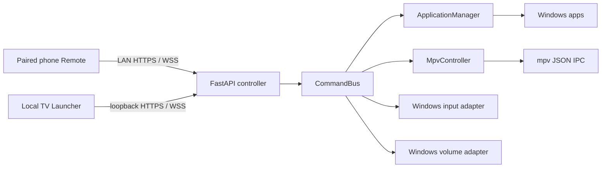

# Architecture

## Process boundary

FastAPI is the sole transport server. The React TV Launcher and React Remote consume server state; neither calls Windows APIs or launches applications. Every control source becomes one protocol message and flows through `CommandBus`.

## Native Remote

`mobile/` is an Expo/React Native client, not a second controller. It pairs only through the existing numeric-IP HTTPS endpoint, then sends the same protocol messages through `wss://<controller-IP>:<port>/ws/remote`. Its native WebSocket implementation supplies the matching `origin` request header required by the controller. Pairing tokens are stored separately from device metadata in device-bound Expo SecureStore; a migration removes legacy plaintext metadata tokens.

QR pairing is the primary endpoint-discovery path. A code-only QR is never assigned an invented address: the user must supply a numeric LAN IP. The app intentionally does not perform arbitrary subnet scans. Android's generated native network policy disallows cleartext and trusts only the system and user CA stores so the manually trusted controller CA works without weakening TLS for the app.

## Backend modules

| Module | Responsibility |
|---|---|
| `app/protocol.py` | Versioned, strict Pydantic WebSocket models and command whitelist. |
| `app/websocket/` | Authenticated connection registry and state fan-out. |
| `app/security/` | Pairing codes, salted token store, and the per-user local CA/IP-SAN TLS materials. |
| `app/commands/bus.py` | Central command routing, state/error outcome, and launcher focus transitions. |
| `app/applications/manager.py` | Tracks only child processes/windows created by this project. |
| `app/player/channels.py` | Validates and selects enabled, ordered channels. |
| `app/player/mpv.py` | Starts mpv and controls it over named-pipe JSON IPC. |
| `app/system/` | Narrow Windows adapters for mouse, Unicode text, windows, sleep, and Core Audio volume. |
| `app/state.py` | Lock-protected controller state snapshot shared by all transports. |
| `app/controller.py` | Composition root that injects platform adapters and coordinates cleanup. |

## Command flow

1. A Remote loads `https://<controller-literal-IP>:<port>/remote`; the server rejects plaintext LAN access, arbitrary Host names, and mismatched browser Origins.
2. The Remote connects with `wss://`, has bounded pre-authentication admission, and must authenticate with a valid token before any command, pointer, or text-input message.
3. `CommandBus` selects an owned application, mpv, input, power, or volume action.
4. The bus updates `StateStore` only after the action outcome is known.
5. `ConnectionRegistry` broadcasts a new `state` message only when an observable state value changed, filtering invalid Remote sessions first.
6. The source Remote receives an `ack` for each request ID.

The TV socket accepts only `CommandMessage`, requires both a loopback client address and the exact local TV Origin, and cannot pair, send text, or move the pointer. Production startup opens it through HTTPS; plaintext is retained only for the loopback development proxy.

## Ownership and Home

`ApplicationManager` creates and records each browser child process. `HOME` calls `ApplicationManager.home()`: it minimizes the specific tracked window, closes the controller-owned mpv process through its adapter, and restores the window titled `MY TV`. It never searches for or terminates arbitrary Brave, Edge, or mpv processes.

## State model

`ControllerState` contains:

- `active_app`: `launcher`, `youtube`, `netflix`, `live_tv`, or `browser`.
- `focused_tile`: launcher focus source of truth.
- `volume` and `muted`.
- `channel_number` and `channel_name` when Live TV is active.
- `error_message` and transient `status_message` for explicit UI feedback.

Each connected, still-valid paired Remote receives snapshots after state changes, so multiple remotes converge on the same state. Revoked, evicted, and expired sessions are removed before state fan-out; an authenticated socket is also closed when its token expires.

## Failure containment

Browser lookup, process launch, mpv IPC, volume access, named-pipe input, and Windows UI automation are behind small protocols. The production composition root uses Windows implementations; tests inject fakes. Dependency failure becomes a typed `CommandExecutionError` and a displayed state error instead of crashing the controller.

## Remote transport security

`start.ps1` generates or reuses a CA under ignored `config\tls`, refreshes its leaf certificate when the controller IP changes, and starts Uvicorn with that certificate and key. The CA uses a DER `.cer` file so Windows and mobile OS certificate installers can consume it. It must be trusted separately on the TV Windows user and every Remote phone; the script prints its SHA-256 fingerprint for an out-of-band comparison. No plaintext LAN Remote route is available after production startup.

## Extension points

Future ESP32, HDMI-CEC, keyboard, or voice transports must only translate their input to `CommandMessage` and call `CommandBus`. They must not directly import application managers, subprocess, or Windows APIs. This preserves the same authorization and state synchronization boundary for every future input source.
